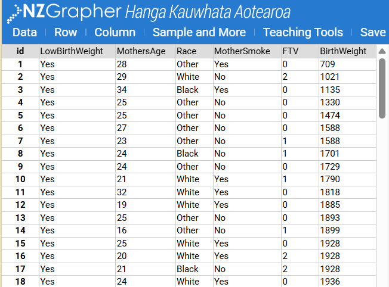

```{r}
#| label: setup
library(tidyverse)
library(broom)
library(MASS)

theme_set(theme_minimal(base_size = 13))
set.seed(91946)
```

## Statistical Enquiry Using PPDAC

This report is a full statistical enquiry written at a standard that targets Excellence for AS91944 (1.1). The investigation follows the complete PPDAC cycle: Problem, Plan, Data, Analysis, and Conclusion.

::::: columns
::: {.column width="45%"}
{fig-alt="PPDAC statistical enquiry cycle" fig-align="center"}
:::

::: {.column width="55%"}
The PPDAC cycle is the framework for a statistical enquiry. Each stage has a different purpose, and the stages work together to help you ask, investigate, and answer a question in context.

-   **Problem:** define the question and identify the variables.
-   **Plan:** decide how data will be gathered and checked.
-   **Data:** collect and record the information accurately.
-   **Analysis:** use graphs and summary statistics to look for patterns.
-   **Conclusion:** answer the question using evidence and explain any limitations.
:::
:::::

## Problem

::: callout-note
### Student note

When undertaking a statistical inquiry we need to make sure that we select our statistical question so that it meets the requirements and allows us to generate a robust statistical analysis.

For this example we are going to look at two numerical variables in a relationship investigation. Given the dataset we are working with (Figure 1), we need to select variables and an appropriate statistical question.
:::

{fig-align="center"}

### Variable types

::: callout-tip
### Metadata note

The metadata on the nzGrapher site helps us identify the meaning of each variable, how it was measured, and whether it is categorical or numerical. This is important because a correct variable type determines the most appropriate graph and analysis.
:::

```{r}
#| label: data-types-tree
#| fig-cap: "Classification of data types."
#| echo: false

# Simple text-based tree using plot
plot(0, 0, xlim = c(0, 10), ylim = c(0, 6), type = "n",
     axes = FALSE, xlab = "", ylab = "", main = "Types of Data")

# Data node
rect(3.5, 5, 6.5, 5.8, col = "#2c7bb6", border = NA)
text(5, 5.4, "Data", col = "white", font = 2)

# Categorical node
rect(0.5, 3, 3.5, 3.8, col = "#4dac26", border = NA)
text(2, 3.4, "Categorical", col = "white", font = 2)

# Numerical node
rect(6.5, 3, 9.5, 3.8, col = "#d7191c", border = NA)
text(8, 3.4, "Numerical", col = "white", font = 2)

# Nominal
rect(0, 1, 2, 1.8, col = "#b8e186", border = NA)
text(1, 1.4, "Nominal", font = 2, cex = 0.9)

# Ordinal
rect(2.2, 1, 4.2, 1.8, col = "#b8e186", border = NA)
text(3.2, 1.4, "Ordinal", font = 2, cex = 0.9)

# Discrete
rect(5.5, 1, 7.5, 1.8, col = "#f4a582", border = NA)
text(6.5, 1.4, "Discrete", font = 2, cex = 0.9)

# Continuous
rect(7.8, 1, 9.8, 1.8, col = "#f4a582", border = NA)
text(8.8, 1.4, "Continuous", font = 2, cex = 0.9)

# Connecting lines
segments(5, 5, 2, 3.8, lwd = 1.5)
segments(5, 5, 8, 3.8, lwd = 1.5)
segments(2, 3, 1, 1.8, lwd = 1.5)
segments(2, 3, 3.2, 1.8, lwd = 1.5)
segments(8, 3, 6.5, 1.8, lwd = 1.5)
segments(8, 3, 8.8, 1.8, lwd = 1.5)
```

#### Categorical data

**Categorical (qualitative) data** describes qualities or categories. The values are labels, not numbers.

##### Nominal data

Nominal data has **no natural order**. Categories are just names.

**Examples:** - Eye colour (brown, blue, green, grey) - Favourite sport (rugby, netball, football, basketball) - Type of transport to school (bus, car, walk, bike)

##### Ordinal data

Ordinal data has a **natural order**, but the gaps between categories are not equal.

**Examples:** - Survey ratings (strongly disagree → disagree → neutral → agree → strongly agree) - Year group (Year 9, Year 10, Year 11, Year 12, Year 13) - Clothing size (XS, S, M, L, XL)

#### Numerical data

**Numerical (quantitative) data** represents quantities that can be measured or counted.

##### Discrete data

Discrete data can only take **specific, separate values** (usually whole numbers from counting).

**Examples:** - Number of siblings - Number of text messages sent per day - Goals scored in a rugby match

##### Continuous data

Continuous data can take **any value within a range** (usually from measuring).

**Examples:** - Height (cm) - Weight (kg) - Time to complete a race (seconds) - Temperature (°C)

### Investigative question

::: callout-tip
### Type of question
Statistical questions are grouped into three different types of questions that require different statistical methods and figures. These are: Relationship, Comparision, 
A statistical question does not asking for one single value, but rather for a pattern or trend across many observations.
:::


**What is the relationship between birth weight and age of the mother?**

This means that I will be looking at the relationship between two numerical (continuous) variables.

A relationship question is used when we are investigating whether there is a connection between two numerical variables. In this enquiry, the explanatory variable is mother's age and the response variable is birth weight.

Mother's age is a numerical variable measured in whole years, so it is treated as a discrete numerical variable in this dataset, although it is conceptually continuous in the underlying measurement.

## Purpose

### Context

::: callout-note
### Context note

Birth weight is an important health indicator for newborn babies. Maternal age is often discussed as a factor that could be linked with differences in birth outcomes. A statistical investigation does not just describe the dataset; it also helps us explain the pattern in context and consider whether the result is likely to be meaningful.
:::

Birth weight is an important health indicator for newborn babies. Maternal age is often discussed as a factor that could be linked with differences in birth outcomes. Understanding whether older or younger mothers tend to have heavier or lighter babies can help us discuss patterns in maternal and infant health.

### Population, sample, and variables

::: callout-note
## Variables

When writing a good statistical question, it is important to identify the explanatory and response variables clearly. The explanatory variable is the one we think may help explain changes in the response variable.
:::

-   Population of interest: births to mothers in a broader maternal health context.
-   Available sample: 189 births in the `MASS::birthwt` dataset (secondary data from a hospital-based study).
-   Explanatory variable: mother's age (years).
-   Response variable: birth weight (grams).

The variables are both numerical, so a relationship can be investigated using scatterplots, trend lines, correlation, and linear regression.

### Hypothesis

Before looking at the data, I expect there may be a weak positive relationship: as maternal age increases, birth weight might increase slightly, but not strongly. I also expect high variability because many other factors influence birth weight (such as smoking, gestation, health conditions, and prenatal care).

## Plan

To answer the question clearly and justify conclusions, I will:

1.  Prepare and check the data.
2.  Explore each variable with a box and whisker plot with points.
3.  Create a scatterplot of `birth weight` vs `mother's age`.
4.  Split points in half and draw a straight line through your data points.
5.  Estimate QCR.
6.  Write a statistical conclusion related to the statistical evidence.
7.  Evaluate unusual and influential points.
8.  Write a contextual conclusion with limitations and improvements.

### Excellence

- Calculate correlation and fit a linear model.
- Check residual diagnostics for model suitability.
- Write out what the analysis and numbers mean in context.


## Data

::: callout-note
## Summary statistics

After you have formalised your problem and created a plan the next task is to look at each variable independently. Create a table with the following summary statistics in it: mean, median, mode, sample size, range,  
:::

```{r}
#| label: data-prep
babies <- as_tibble(MASS::birthwt) %>%
  transmute(
    mother_age = age,
    birth_weight = bwt,
    low_birth_weight = factor(low, levels = c(0, 1), labels = c("No", "Yes"))
  ) %>%
  filter(!is.na(mother_age), !is.na(birth_weight))

glimpse(babies)

babies %>%
  summarise(
    n = n(),
    min_age = min(mother_age),
    max_age = max(mother_age),
    median_age = median(mother_age),
    min_bwt = min(birth_weight),
    max_bwt = max(birth_weight),
    median_bwt = median(birth_weight)
  )
```

### Data quality notes

-   This is secondary observational data, not data I collected myself.
-   The sample is not a random sample of all births in New Zealand, so findings should not be generalized too broadly.
-   The sample size is moderate (189), which is enough for pattern detection but still sensitive to unusual values.

## Analysis

### 1. Single-variable displays

```{r}
#| label: graph-age-dist
#| fig-cap: "Distribution of mother's age"
ggplot(babies, aes(x = mother_age)) +
  geom_histogram(binwidth = 2, fill = "#2f5d8a", color = "white") +
  labs(x = "Mother's age (years)", y = "Count")
```

```{r}
#| label: graph-bwt-dist
#| fig-cap: "Distribution of birth weight"
ggplot(babies, aes(x = birth_weight)) +
  geom_histogram(binwidth = 250, fill = "#c96b3b", color = "white") +
  labs(x = "Birth weight (grams)", y = "Count")
```

The mother-age distribution is concentrated in the late teens to late twenties. Birth weight shows a wide spread, with a tail toward lower weights.

### 2. Relationship graph

```{r}
#| label: graph-scatter-main
#| fig-cap: "Birth weight vs mother's age with linear fit and 95% confidence band"
ggplot(babies, aes(x = mother_age, y = birth_weight)) +
  geom_point(alpha = 0.7, size = 2, color = "#1f1f1f") +
  geom_smooth(method = "lm", se = TRUE, color = "#0d6efd", linewidth = 1) +
  geom_smooth(method = "loess", se = FALSE, color = "#dc3545", linetype = "dashed", linewidth = 1) +
  labs(
    x = "Mother's age (years)",
    y = "Birth weight (grams)",
    subtitle = "Blue = linear fit, Red dashed = smooth trend"
  )
```

From the scatterplot, there is a slight upward trend, but the points are widely spread around the line. This suggests any linear relationship is likely weak.

### 3. Grouped comparison by age bands

```{r}
#| label: graph-age-bands
#| fig-cap: "Birth weight by maternal age band"
babies_band <- babies %>%
  mutate(
    age_band = cut(
      mother_age,
      breaks = c(13, 19, 24, 29, 35, 46),
      include.lowest = TRUE,
      labels = c("14-19", "20-24", "25-29", "30-35", "36-45")
    )
  )

ggplot(babies_band, aes(x = age_band, y = birth_weight)) +
  geom_boxplot(fill = "#9ecae1", outlier.color = "#d62728") +
  labs(x = "Mother age band (years)", y = "Birth weight (grams)")
```

The medians across age bands are fairly similar, with some increase through the middle age groups, but with substantial overlap in spread. This supports the idea of a weak relationship rather than a strong one.

### 4. Correlation and linear model

```{r}
#| label: model-fit
cor_test <- cor.test(babies$mother_age, babies$birth_weight)
cor_test

model <- lm(birth_weight ~ mother_age, data = babies)
summary(model)

tidy(model, conf.int = TRUE)
glance(model)
```

Interpretation of key outputs:

-   The correlation coefficient is positive but small.
-   The fitted slope is positive, meaning predicted birth weight increases as mother's age increases.
-   $R^2$ is small, so mother's age explains only a small proportion of birth-weight variation.

This means maternal age has limited predictive power on its own.

### 5. Diagnostic graphs (assumptions and unusual values)

```{r}
#| label: diagnostics
#| fig-cap: "Standard linear model diagnostic plots"
par(mfrow = c(2, 2))
plot(model)
par(mfrow = c(1, 1))
```

Diagnostic interpretation:

-   Residuals vs fitted: no severe curvature, but spread is wide.
-   Normal Q-Q: some deviation in tails, indicating residuals are not perfectly normal.
-   Scale-location: some mild heteroscedasticity is possible.
-   Residuals vs leverage: a few potentially influential observations exist, but no extreme leverage points dominating the model.

Overall, the linear model is acceptable for describing broad trend direction, but it is not a high-accuracy predictive model.

### 6. Influence check

```{r}
#| label: influence-check
influence_tbl <- augment(model) %>%
  mutate(obs = row_number(), cooks = cooks.distance(model)) %>%
  arrange(desc(cooks)) %>%
  dplyr::select(obs, mother_age, birth_weight, .fitted, .resid, cooks) %>%
  slice(1:5)

influence_tbl
```

The highest Cook's distance values should be examined as influential points. In this dataset they influence exact slope size, but they do not reverse the overall weak-positive relationship.

## Conclusion

### Answer to the investigative question

There is a **weak positive relationship** between birth weight and mother's age in this sample. As mother's age increases, predicted birth weight tends to increase slightly, but the association is weak and there is a lot of scatter.

### Statistical evidence summary

-   Scatterplot trend is slightly upward.
-   Correlation is positive but small.
-   Linear regression slope is positive.
-   Low $R^2$ indicates age alone explains only a small amount of variation.

### Contextual meaning

In practical terms, mother's age by itself is not enough to accurately predict birth weight. Birth weight is likely influenced by multiple factors, including smoking status, gestation length, maternal health, nutrition, and socioeconomic conditions.

### Limitations (critical evaluation for Excellence)

1.  This is observational secondary data, so we can describe association but not prove causation.
2.  The dataset is not a representative random sample of all births, limiting generalization.
3.  Important confounders were not controlled in this single-variable model.
4.  Mild assumption issues and influential points reduce precision.

### Improvements and next steps

To improve this enquiry, I would:

1.  Build a multiple regression model including smoking status, gestation, and maternal weight.
2.  Compare relationships within subgroups (for example smokers vs non-smokers).
3.  Use a larger and more representative dataset from the target population.

## Reflection on the PPDAC cycle

The PPDAC structure helped produce a clear and rigorous investigation:

-   Problem clarified the exact relationship question and variables.
-   Plan ensured analysis methods matched variable types.
-   Data checks highlighted limitations before overclaiming.
-   Analysis combined visual and numerical evidence.
-   Conclusion answered the question with evidence and included statistical critique.

This is the level of statistical communication expected for an Excellence response: clear evidence, contextual interpretation, and critical evaluation of method quality.
